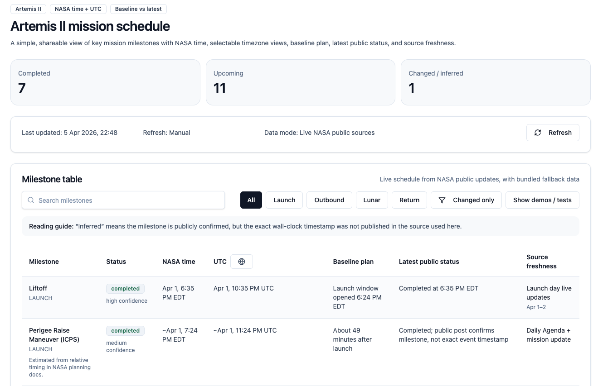

# Artemis II Mini App

A simple, shareable Artemis II mission schedule app with:
- NASA time plus selectable timezone views
- baseline plan vs latest public status
- source freshness
- readable table-first layout
- live refresh against a normalized local API endpoint
- a lightweight test suite for refresh and sync logic

## App Preview



Preview app on Vercel:
https://artemis-mini-app.vercel.app

## Run locally

```bash
npm install
npm run dev
```

Then open `http://localhost:3000`.

## Notes

This repo is self-contained and does not require shadcn CLI setup.
The current version keeps bundled milestone data as a fallback, then refreshes from `/api/artemis-schedule`.

## Tests

```bash
npm test
```

The tests cover:
- the schedule sync pipeline without real network calls
- the client refresh helper used by the page
